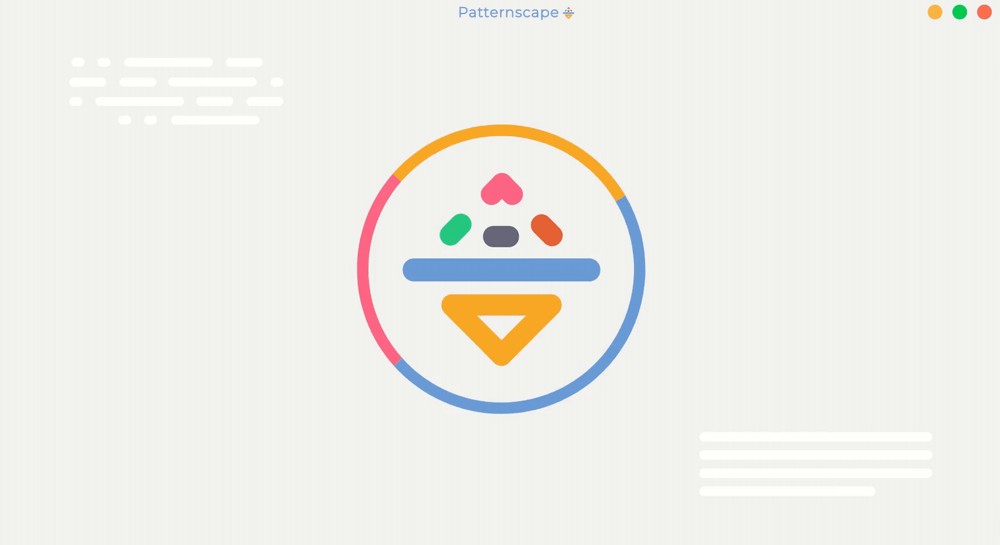

<!-- PROJECT LOGO -->
<br />
<p align="center">
  
  <h1 align="center">Password Tool</h1>
  <p align="center">
    A project designed to understand different patterns out of data breaches.
  </p>
</p>
      

<!-- TABLE OF CONTENTS -->
## Table of Contents
* [Download](#download)
  * [Windows](#win64)
  * [MacOS](#win64)
  * [Linux](#win64)
* [Requirements](#requirements)
* [Installation](#installation)
  * [64 bit (Recommended)](#64bit)
  * [32 bit](#32bit)
* [Roadmap](#roadmap)

## Download App (binaries) <i id="download"></i>
  * Windows
    * [64 bit](https://drive.google.com/open?id=1yWabjDeCFd34bbs4m5pPkWMHKxtHk6ds)<i id="win64"></i>

## Requirements: <i id="requirements"></i> 
* Nodejs [^12.16.1](https://nodejs.org/en/)
* CMake [^3.17.1](https://cmake.org/download/)
* A proper C/C++ compiler toolchain
  * Visual Studio 2019 ([the free Community](https://visualstudio.microsoft.com/vs/community/) version works well)

## Installation: <i id="installation"></i>
### Architecture 64-bit (Recommended) <i id="64bit"></i>
```
git clone https://github.com/AtiqGauri/PasswordTool.git
cd PasswordTool/PasswordTool_GUI
npm install
npm start
```
#### Architecture 32-bit <i id="32bit"></i>
```
git clone https://github.com/AtiqGauri/PasswordTool.git
cd PasswordTool/PasswordTool_GUI
npm run install32
npm start
```
    
## Project Roadmap <i id="roadmap"></i>
  * [Timeline](https://paper.dropbox.com/doc/Projects-Timeline--AzP0A3Y1v5yEfAw5e8cNhcApAg-BoYhgTkFCHQ91an0uF9eg)